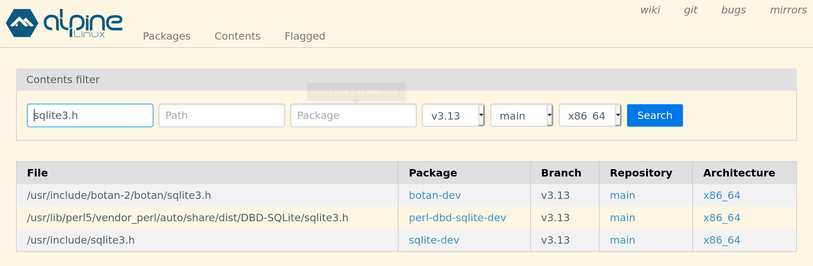

# apkman
Package Manager and Toolbox for enclave development

Alpine Linux is MUSL based. Alpine Linux packages are compatible for use with OE SDK.

apkman makes it easy to use Alpine Linux packages for developing enclaves.

# Installation

[`apkman`](https://raw.githubusercontent.com/openenclave/openenclave/feature/apkman/tools/apkman/apkman) is a self-contained bash script.
Download it from openenclave repository, make it executable and add to path.


```bash
wget https://raw.githubusercontent.com/openenclave/openenclave/feature/apkman/tools/apkman/apkman
chmod +x apkman
# Add location of apkman to PATH
```

# Usage

## Installing packages
Search for packages using `apkman search`. 

Install packages using `apkman add`.

Look for `-static` and `-dev` packages.


If unsure of package use https://pkgs.alpinelinux.org/contents to search for package with given contents.



## Using packages

`apkman root` command gives the path to root folder of Alpine Linux distribution that `apkman` manages.

Add `$(apkman root)/usr/include` to compiler include paths.
Add `$(apkman root)/usr/lib` to linker path.
Add other folders as needed.

Use headers (e.g `sqlite.h`) in C/C++ code. Add library (e.g `libsqlite.a`) to linker.


## Installing and using tools

Install necessary tools via `apkman add`.

Use `apkman exec` to run the tool.

Using tools via apkman ensures that the artifacts generated by the tools are compatible with OE SDK. This approach also allows using the same tool for building enclave artifacts even if the specific version of the tools is not available on the host system.


## Build libraries using apkman

Use `apkman exec sh` or `apkman exec bash` to enter the Alpine Linux distribution managed by `apkman`. Use this environment to build libraries. Alpine-linux compiler toolchain is MUSL based and therefore the built libraries are OE SDK compatible.

Here is an example of building a Web Assembly interpreter using `apkman`.


## Demos

- Libraries
  - [libcurl](https://github.com/openenclave/openenclave/tree/feature/apkman/tests/tools/apkman/libs/curl) Demonstrating use of standard libcurl to perform HTTP request. 
  - [libevent](https://github.com/openenclave/openenclave/tree/feature/apkman/tests/tools/apkman/libs/event) Demonstrates use of `libevent` to write a simple echo server.
  - [libgmp](https://github.com/openenclave/openenclave/tree/feature/apkman/tests/tools/apkman/libs/gmp) Demonstrates use of GNU Multi-Precision Library to compute digits of Pi.
  - [hiredis](https://github.com/openenclave/openenclave/tree/feature/apkman/tests/tools/apkman/libs/hiredis) Demonstrates use of hiredis C client library to perform basic database operations.
  - [sqlite](https://github.com/openenclave/openenclave/tree/feature/apkman/tests/tools/apkman/libs/sqlite) Demonstrates use of sqlite to create an in-memory database and perform database operations.
  - [zlib](https://github.com/openenclave/openenclave/tree/feature/apkman/tests/tools/apkman/libs/zlib) Demonstrates use of zlib compression library to compress and decompress files.
  
- Cpp
  - [boost](https://github.com/openenclave/openenclave/tree/feature/apkman/tests/tools/apkman/cpp/boost) Demonstrates use of some boost libraries like bimap, multiprecision, serialization
  - [cpp20](https://github.com/openenclave/openenclave/tree/feature/apkman/tests/tools/apkman/cpp/cpp20) Demonstrates use of coroutines
  - [protobuf](https://github.com/openenclave/openenclave/tree/feature/apkman/tests/tools/apkman/cpp/protobuf) Demonstrates use of protocol buffers within enclave.
  
- Runtimes
  - [lua](https://github.com/openenclave/openenclave/tree/feature/apkman/tests/tools/apkman/runtimes/lua) Demonstrates use of Lua which is a powerful, efficient, lightweight, embeddable scripting language.
  - [ocaml](https://github.com/openenclave/openenclave/tree/feature/apkman/tests/tools/apkman/runtimes/ocaml) Demonstrates use of Ocaml which is a functional programming lanuguage used in financial industry as well as for writing static analysis tools.
  - [quickjs](https://github.com/openenclave/openenclave/tree/feature/apkman/tests/tools/apkman/runtimes/quickjs) Demonstrates use of QuickJS which is a small embeddable Javascript Engine that supports ES2020 specification.
  - [wasm](https://github.com/openenclave/openenclave/tree/feature/apkman/tests/tools/apkman/runtimes/wasm) Demonstrates use of wasm3 which is a Web Assembly interpreter.
  
  
## Design

`apkman` maintains an Alpine Linux distribution instance  at `~/.apkman/alpine-fs`. 
Alpine Linux exists as a regular directory. This makes it trivial to use headers and libraries from the Alpine distribution to build enclaves.

Traditionally, root filesystems are "entered" via the [`chroot` (change root)](https://man7.org/linux/man-pages/man2/chroot.2.html) command.
However, `chroot` requires `sudo` access. This makes it less than ideal for development purposes.
Super user access may not always be available. Additionally, any files touched by a super user process will have root ownership and cannot be easily managed by a non super-user process.

To avoid the need for root access, apkman "enters" the Alpine Linux distribution via the following commands:

- [`unshare`](https://man7.org/linux/man-pages/man2/unshare.2.html) command which allows creating a separate user namespace in which `chroot` can be executed.
- or `proot` when `unshare` is not available. [`proot`](https://proot-me.github.io/) is an implementation of `chroot` using `ptrace`. Is typically used to run Linux distributions atop restrictive environments like Android.

# Cross compilation

Using [binfmt_misc](https://www.kernel.org/doc/html/v4.14/admin-guide/binfmt-misc.html) and qemu user space emulation, it is possible to run ARMv7 Alpine Linux distribution on x86-64 machine. This allows managing ARMv7 packages via apkman.


